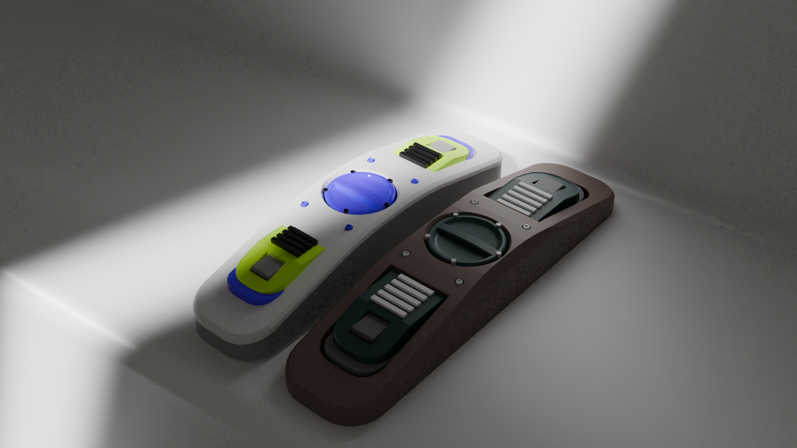
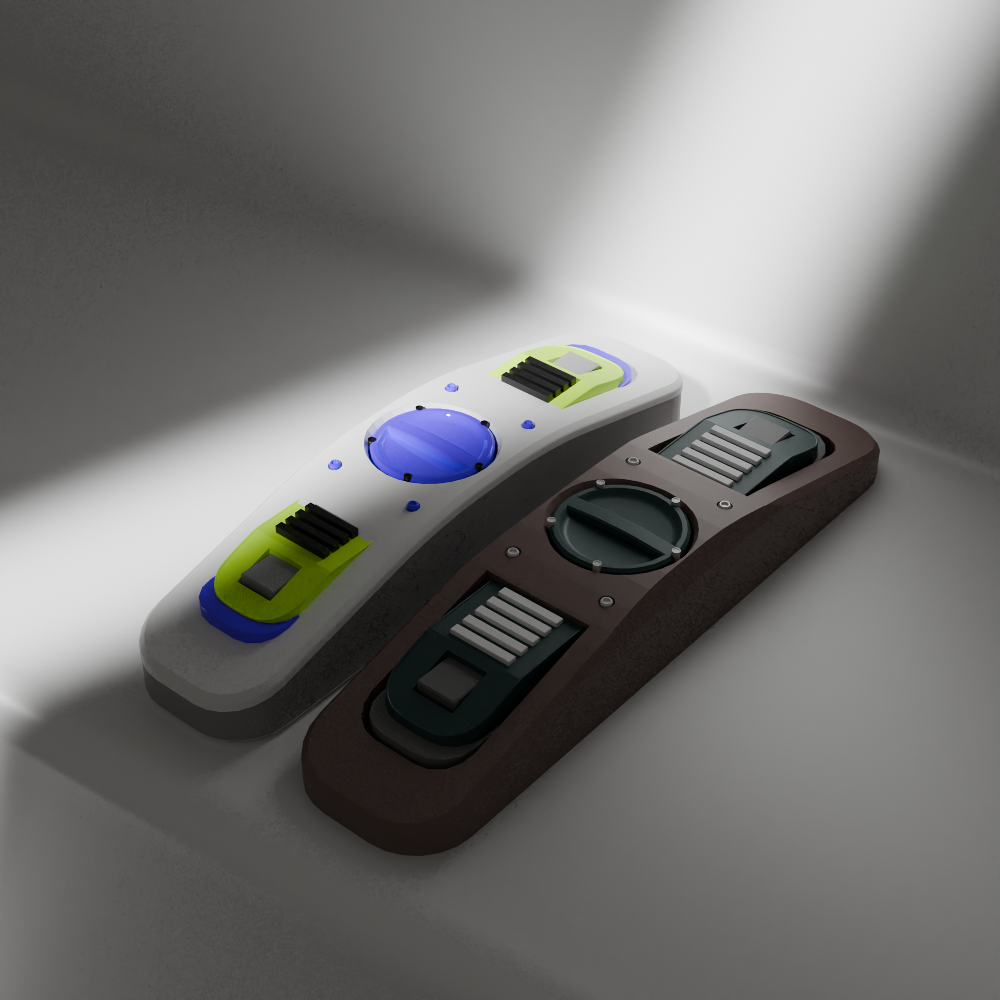
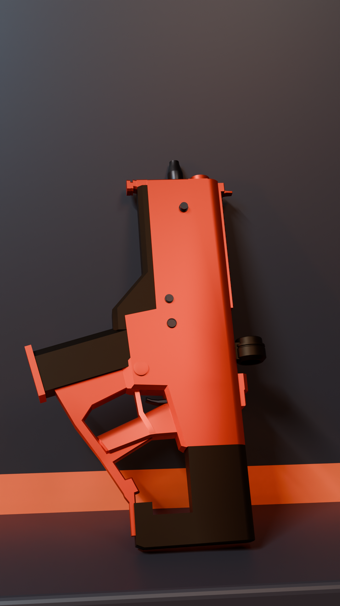
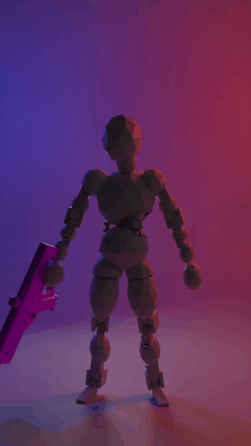
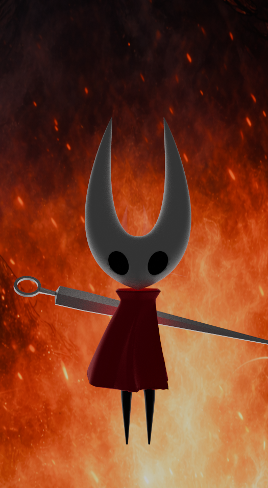
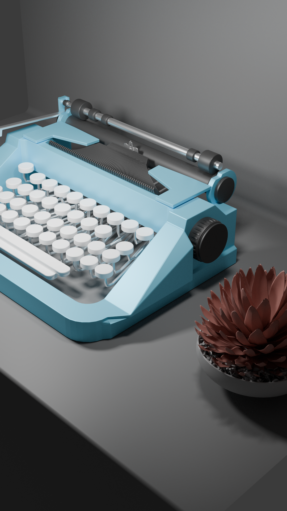

# Blender Misc Workspace

Blender models in Blender and sometimes glTF 2 format, along with hdri files and render output.

This repo includes a bunch of unfinished models and some render output that I used for my portfolio site. Theres lots of garbage and fluff as well. When this gets too bloated, I'll take my favorite stuff and move it into a new repo and retire this one. 

Some of my favorite models are:

### Shape 2
Some generic modeling based on the Bevels and Booleans mech course.

### Shape 3
Some generic modeling based on the Bevels and Booleans mech course.

### Oreo (Inspired by [Dovolo](https://www.youtube.com/shorts/dAl5pHsJfdo))

### Apple M4 Toast Pro (Mock Concept)

### Rifle 1

### Mech 1

### Hornet from Hollow Knight: Silksong

### Scifi Typewriter

<!-- ### "Evil Drone" - Baal-Eye Mk II
This was done as modeling practice. The folder contains concept art generated by MidJourney.
 -->

### Compositing
- **Video (MP4)**: [`0001-0177.mp4`](compositing/output/0001-0177.mp4)
