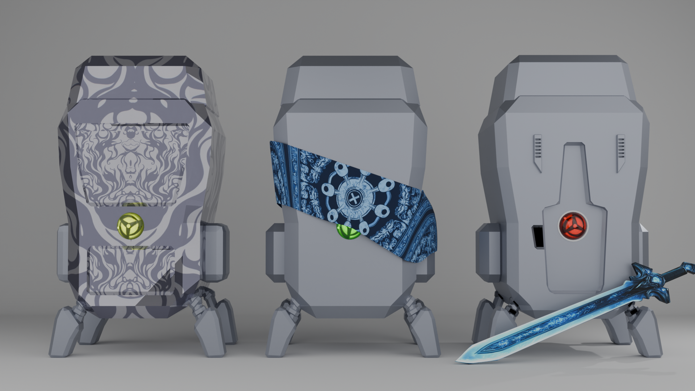
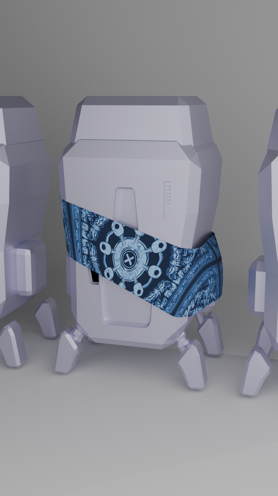
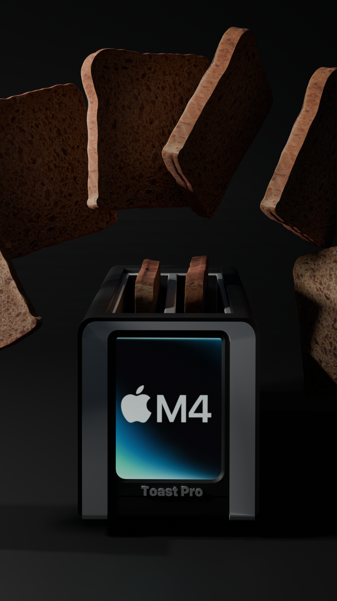
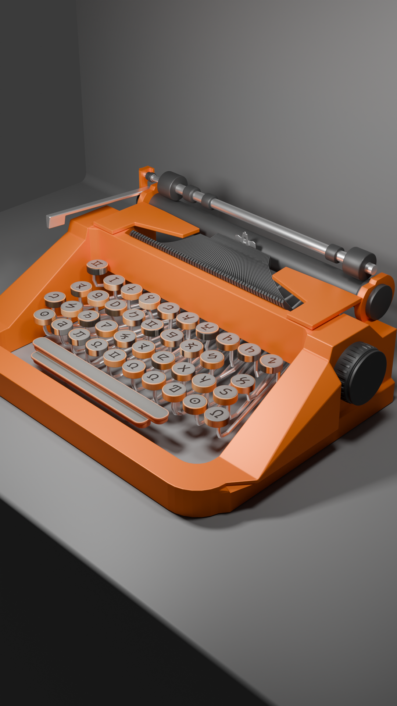
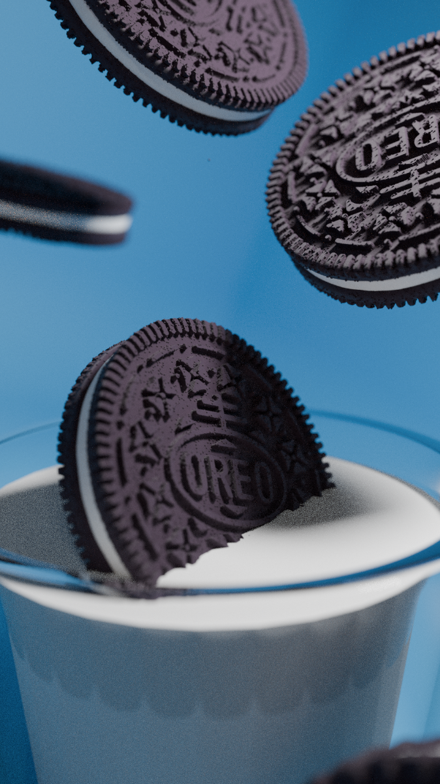

Messing around with Blender
<!-- Blender models in Blender and sometimes glTF 2 format, along with hdri files and render output.

This repo includes a bunch of unfinished models and some render output that I used for my portfolio site. Theres lots of garbage and fluff as well. When this gets too bloated, I'll take my favorite stuff and move it into a new repo and retire this one. 

Some of my favorite models are: -->

#### Anime Inspired Robots (Attempt 1)

#### Apple M4 Toast Pro

#### Scifi Typewriter

#### Oreo (Inspired by [Dovolo](https://www.youtube.com/shorts/dAl5pHsJfdo))

<!-- ### "Evil Drone" - Baal-Eye Mk II
This was done as modeling practice. The folder contains concept art generated by MidJourney.
 -->
